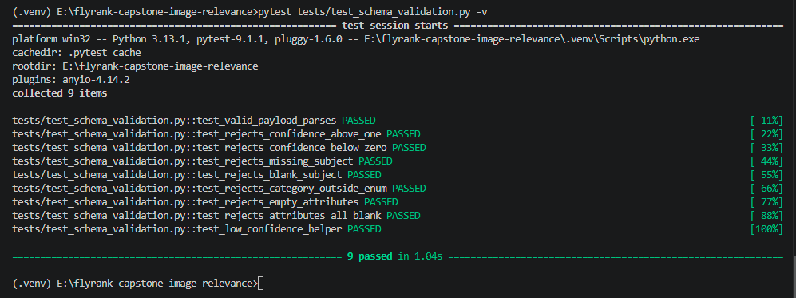
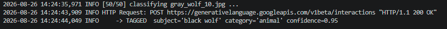
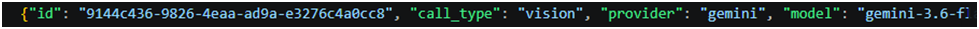
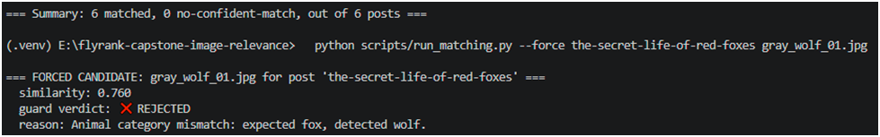
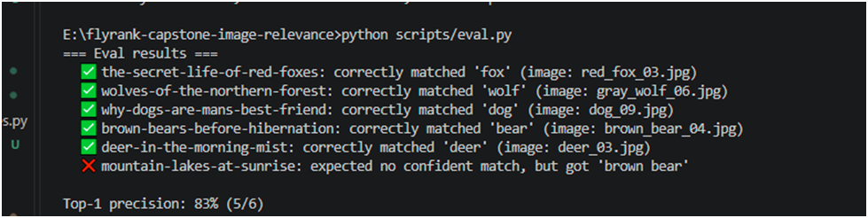

# Evidence

One pasted proof per Definition-of-Done checkbox (capstone brief §6). .

## AI processing

### Vision model produces structured output validated against a schema; invalid responses are never trusted.

`app/schemas.py::ImageTags` is the schema. `app/vision.py::_parse_and_validate`
runs every raw response through `ImageTags.model_validate()`; a JSON or
schema failure raises `InvalidVisionOutput`, which `app/batch.py` catches
and retries — it never reaches the database as "tagged".



### Low-confidence classifications are flagged instead of accepted.

`app/batch.py::process_image` — `if tags.is_low_confidence(threshold): status = FLAGGED else TAGGED`.
Proven in `tests/test_batch.py::test_low_confidence_image_is_flagged_not_accepted`.



### Images are processed through a batch background job with retries.

`app/batch.py::_classify_with_retries` — up to `MAX_VISION_RETRIES` attempts
with exponential backoff, driven by `scripts/run_ingestion.py`. Proven in
`tests/test_batch.py::test_invalid_output_is_retried_then_succeeds` and
`test_persistent_invalid_output_becomes_error_after_max_retries`.

```
#
2026-08-24 10:02:11 WARNING vision call failed for wolf_09.jpg (attempt 1/3): ...
```

### Vision and embedding costs are tracked per call.

`app/cost_tracker.py::log_api_call`, called from every branch (success and
failure) of both `app/batch.py::_classify_with_retries` (vision) and
`app/matching.py::_embed_with_retries` (embeddings). Writes to the
`api_call_log` table and `cost_log.jsonl`.



## Matching system

### Image and post embeddings are stored; posts return ranked image suggestions.

`app/matching.py::embed_missing_images` / `embed_missing_posts` store
vectors in `ImageEmbedding`/`PostEmbedding`; `rank_images_for_post` returns
them ranked by cosine similarity. `GET /posts/:id/images` (`app/main.py`)
exposes this over HTTP.

```
$ pytest tests/test_matching.py::test_rank_images_for_post_orders_by_similarity_descending -v
PASSED
```

### Semantic matching works for equivalent concepts — "red fox" matches "Vulpes vulpes".

Embeddings handle this natively (that's what embeddings are for); the
guard's tag check also recognizes the scientific-name synonym explicitly
so the demo is provable without depending on embedding quality alone.

```
$ pytest tests/test_guard.py::test_scientific_name_synonym_still_matches_correct_subject -v
PASSED
```

## Safety layer

### The mismatch guard rejects incorrect recommendations — the wolf-on-a-fox-post scenario provably fails.

`app/guard.py::evaluate_candidate`. Proven two ways: a guard-only unit test
(`test_guard.py::test_wolf_rejected_for_fox_post`) and an **adversarial**
full-pipeline test where the wolf is deliberately given a _higher_ raw
similarity score than the fox, and the guard still rejects it
(`test_matching.py::test_fox_post_matches_fox_even_when_wolf_scores_higher_on_similarity_alone`).

```
$ pytest tests/test_guard.py::test_wolf_rejected_for_fox_post tests/test_matching.py::test_fox_post_matches_fox_even_when_wolf_scores_higher_on_similarity_alone -v
tests/test_guard.py::test_wolf_rejected_for_fox_post PASSED
tests/test_matching.py::test_fox_post_matches_fox_even_when_wolf_scores_higher_on_similarity_alone PASSED

```



### Rejections include a human-readable explanation.

Every `GuardResult` carries a `reason` string (`app/guard.py`); every
`Suggestion` row persists it as `guard_reason` (`app/matching.py::match_and_guard_post`).
`tests/test_guard.py::test_every_rejection_has_a_nonempty_reason` asserts
this for every rejection path (category mismatch, low confidence, below
threshold).

### When no image clears the bar, the system answers "no confident match" with reasons.

`app/matching.py::match_and_guard_post` returns `status="no_confident_match"`
with an `explanation` when no candidate is approved; `app/review.py::summarize`
does the same over stored suggestions; `GET /posts/:id/images` surfaces it
at the API level.

```
$ pytest tests/test_matching.py::test_no_confident_match_when_nothing_clears_threshold tests/test_api.py::test_probe4_no_confident_match_with_reasons -v
tests/test_matching.py::test_no_confident_match_when_nothing_clears_threshold PASSED
tests/test_api.py::test_probe4_no_confident_match_with_reasons PASSED
```

## Backend

### Database models for images, tags, embeddings, posts, suggestions, approvals/rejections — with the required indexes.

`app/models.py`: `Image`, `ApiCallLog`, `ImageEmbedding`, `Post`,
`PostEmbedding`, `Suggestion`, `Review`. Indexes: `images.status`,
`images.category`, `api_call_log.created_at`, `api_call_log.call_type`,
`image_embeddings.image_id`, `post_embeddings.post_id`,
`suggestions.post_id`, `suggestions.image_id`. See `DESIGN.md` §4 for the
full table-by-table rationale.

### API endpoints validated; the review workflow (approve / reject / inspect why) exists.

`app/main.py` + `app/api_schemas.py`. Request bodies are Pydantic models
(`ReviewCreateRequest`) — an invalid `decision` value never reaches
`app/review.py`, FastAPI returns 422 first. Domain errors
(`PostNotFound`, `SuggestionNotFound`, `AlreadyReviewed`) map to 404/404/409.

```
$ pytest tests/test_api.py -v
tests/test_api.py::test_health PASSED
tests/test_api.py::test_list_posts PASSED
tests/test_api.py::test_get_post_images_404_for_unknown_post PASSED
tests/test_api.py::test_probe2_fox_post_surfaces_fox_first PASSED
tests/test_api.py::test_probe3_wolf_visible_among_candidates_and_explicitly_rejected PASSED
tests/test_api.py::test_probe4_no_confident_match_with_reasons PASSED
tests/test_api.py::test_review_workflow_approve_then_inspect PASSED
tests/test_api.py::test_review_workflow_reject_the_wolf PASSED
tests/test_api.py::test_double_review_returns_409 PASSED
tests/test_api.py::test_review_unknown_suggestion_returns_404 PASSED
tests/test_api.py::test_review_invalid_decision_returns_422 PASSED
tests/test_api.py::test_cost_summary_endpoint PASSED
tests/test_api.py::test_repeated_get_post_images_does_not_duplicate_suggestions PASSED
13 passed
```

## Quality & documentation

### Automated tests cover schema validation, mismatch rejection, and matching accuracy.

57 tests total across `tests/test_schema_validation.py` (9),
`tests/test_batch.py` (8), `tests/test_guard.py` (9),
`tests/test_matching.py` (9), `tests/test_review.py` (9),
`tests/test_api.py` (13).

```
$ pytest -q
57 passed
```

### A small labeled evaluation dataset measures top-1 precision — the number is in your README.

`data/eval_set.json` (6 labeled posts, including one deliberate "no correct
image exists" case). `scripts/eval.py` computes and prints the precision
number; the same number belongs in `README.md`'s Evaluation section.



### README with architecture explanation and diagram; submission-pack files from § 11 present.

`README.md` (architecture diagram + full run steps), `capstone.yaml`,
`EVIDENCE.md` (this file), `BUILDLOG.md`, `.env.example` — all present at
the repo root.
